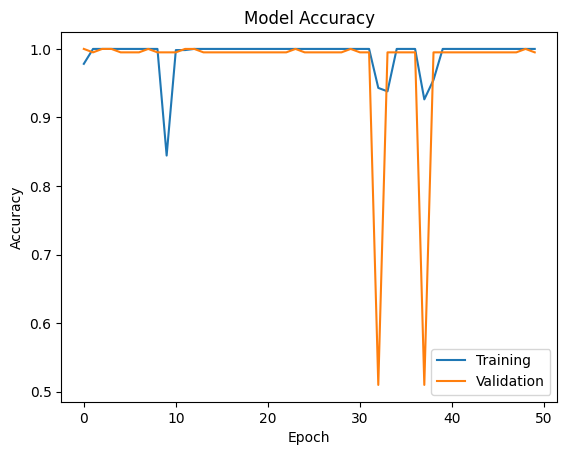
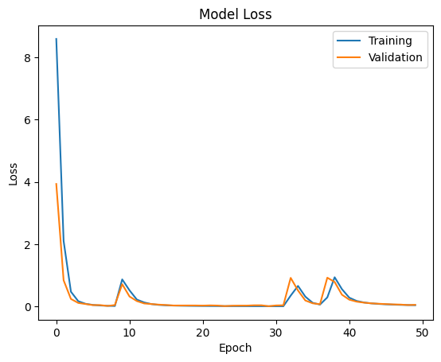
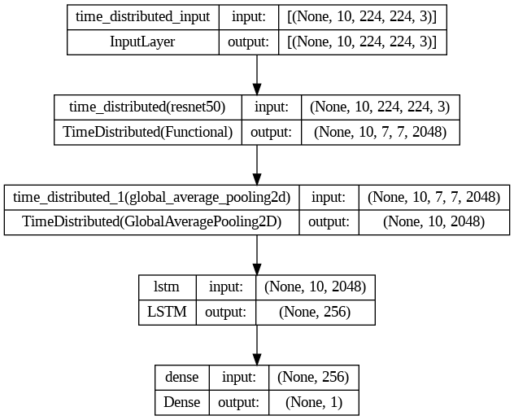

# ResNet and LSTM Model for Deepfake Detection

## Overview

This repository contains code for a deep learning model that combines a ResNet (Convolutional Neural Network) with an LSTM (Long Short-Term Memory) network for the task of deepfake detection. The ResNet is used to extract spatial features from video frames, while the LSTM is employed to capture temporal dependencies across frames.

## Model Architecture

The model architecture consists of two main components:

1. **ResNet**: The ResNet component serves as the spatial feature extractor. It takes individual frames of a video as input and processes them through convolutional layers to extract high-level spatial features.

2. **LSTM**: The LSTM component operates on the extracted spatial features from ResNet. It takes sequences of spatial features (representing consecutive video frames) and learns temporal patterns and dependencies.

## Dataset

The model is trained on a dataset of real and deepfake videos. 900000 frames from 3000 videos are used for training and 200 videos are used for validation. Each video contains 30 frames, and the model is trained to classify whether a video is real or deepfake. Dataset from `Faceforensics++`.

## Results

The model was trained for 50 epochs with the following training and validation results:

`Test Loss: 0.0587, Test Accuracy: 99.50%`

```plaintext
Epoch 1/50
Loss: 8.5923 - Accuracy: 0.9783 - Validation Loss: 3.9361 - Validation Accuracy: 1.0000


Epoch 2/50
Loss: 2.1098 - Accuracy: 1.0000 - Validation Loss: 0.8445 - Validation Accuracy: 0.9950
```


| `Confusion Matrix:`  | Predicted Negative | Predicted Positive |
|-------|--------------------|--------------------|
| **Actual Negative** | 93  | 0 |
| **Actual Positive** | 1   | 106 |


## Hyperparameters

| Hyperparameter        | Value      |
|-----------------------|------------|
| IMAGE_SIZE            | (224, 224) |
| BATCH_SIZE            | 32         |
| NUM_EPOCHS            | 50         |
| NUM_VIDEOS_PER_CLASS  | 1500        |
| NUM_FRAMES_PER_VIDEO  | 10         |
| input_shape           | (10, 224, 224, 3) |
| learning_rate         | 0.001      |
| loss_function         | BinaryCrossentropy |
| optimizer             | Adam       |
| metrics               | Accuracy   |

## Models Graph





### Model architecture


## Acknowledgments

This project was inspired by the following research papers:

1. [FaceForensics++: Learning to Detect Manipulated Facial Images](https://arxiv.org/abs/1901.08971)

## License

This project is for educational purposes only and is licensed under the MIT License. See `LICENSE` for more information.
Acknowledgments and License sections are optional but can be included if necessary.